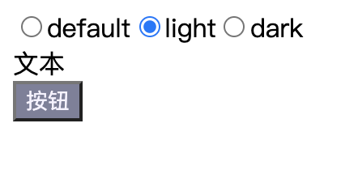
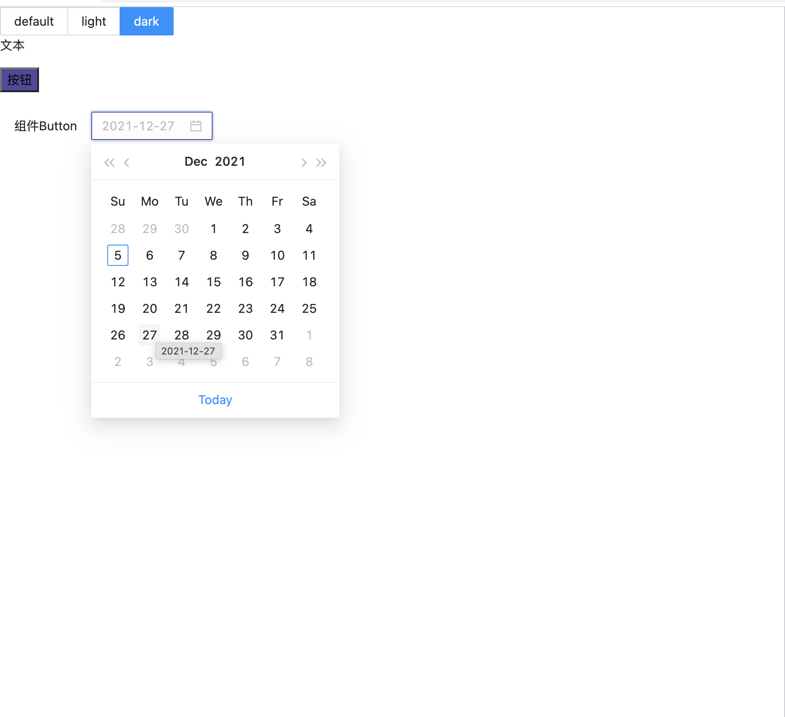
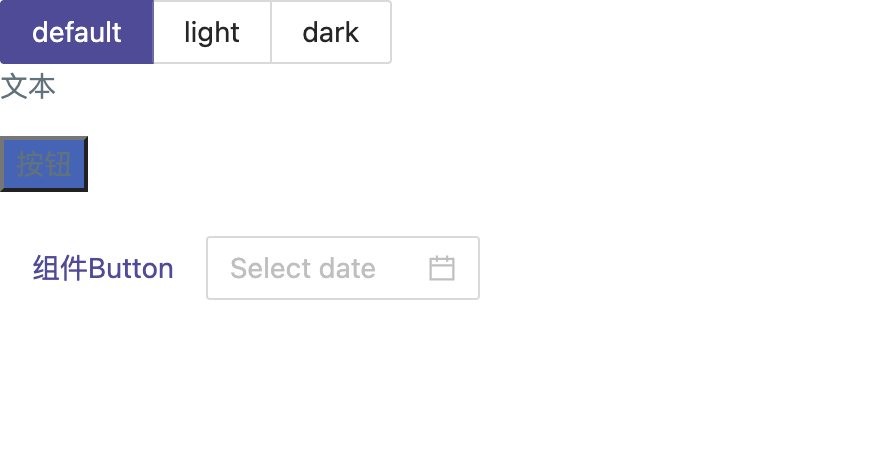

# MultiTheme
#### 前提条件

- Node:` v16.13.1`
- Npm:`v8.1.2`
- `[sudo] npm install -g create-react-app`
- `create-react-app [project-name] --typescript`
  - `cd [project-name]`
  - `npm install`
  - `npm run start`
  - `npm install antd --save`


#### 方案一

##### 借助多个theme-class实现主题切换

1. **配置`less`**

   新创建的`CRA`项目不支持`less`，需要配置`less-loader`。此处选择`[project-name]/config-overrides.js`根目录创建`config-overrides.js`文件覆盖内部`webpack`配置，而不是`run eject`暴露`webpack`配置文件

   `npm install less less-loader --save-dev`

   `npm install react-app-rewired customize-cra --save-dev`

   `[project-name]/package.json`根目录`package.json`替换`react-scripts => react-app-rewired`

   **`less-loader`版本`>=`8时，有几率报错`"TypeError: this.getOptions is not a function"`**，暂时选择7版本

   ```package.json
   // package.json
   {
     "name": "mydemo",
     "version": "0.1.0",
     "private": true,
     "dependencies": {
       "@testing-library/jest-dom": "^5.16.0",
       "@testing-library/react": "^11.2.7",
       "@testing-library/user-event": "^12.8.3",
       "antd": "^4.17.2",
       "react": "^17.0.2",
       "react-dom": "^17.0.2",
       "react-scripts": "4.0.3",
       "typescript": "^4.5.2",
       "web-vitals": "^1.1.2"
     },
     "scripts": {
       "start": "react-app-rewired start",
       "build": "react-app-rewired build",
       "test": "react-app-rewired test",
       "eject": "react-scripts eject"
     },
     "eslintConfig": {
       "extends": [
         "react-app",
         "react-app/jest"
       ]
     },
     "browserslist": {
       "production": [
         ">0.2%",
         "not dead",
         "not op_mini all"
       ],
       "development": [
         "last 1 chrome version",
         "last 1 firefox version",
         "last 1 safari version"
       ]
     },
     "devDependencies": {
       "@types/react": "^17.0.37",
       "@types/react-dom": "^17.0.11",
       "less": "^4.1.2",
       "less-loader": "^7.3.0",
       "react-app-rewired": "^2.1.8",
       "customize-cra": "^1.0.0"
     }
   }
   ```

   ```config-overrides.js
   // config-overrides.js
   const { override, addLessLoader } = require("customize-cra");
   
   module.exports = override(addLessLoader({ lessOptions: {} }));
   ```

2. **编写测试代码**

   `src/index.tsx`作为入口文件

   ```index.tsx
   import React from "react";
   import ReactDOM from "react-dom";
   
   import App from "./class-demo";
   
   ReactDOM.render(
     <React.StrictMode>
       <>
         <App />
       </>
     </React.StrictMode>,
     document.getElementById("root")
   );
   ```

   `src/App.tsx`作为展示文件，`ThemeChange`切换时，切换`class`

   ```App.tsx
   import React from "react";
   import { Radio } from "antd";
   
   import "./law.css";
   import "./theme/index.css";
   import "./App.less";
   
   import ThemeChange from "./ThemeChange";
   
   const AppClass = () => {
     return (
       <>
         <div>文本</div>
         <button>按钮</button>
       </>
     );
   };
   
   const ThemeChange: React.FC<{
     value: string;
     onChange: (value: string) => void;
   }> = ({ value, onChange }) => {
     return (
       <Radio.Group
         optionType="button"
         buttonStyle="solid"
         value={value}
         options={[
           { label: "default", value: "default" },
           { label: "light", value: "light" },
           { label: "dark", value: "dark" },
         ]}
         onChange={(e) => onChange(e.target.value)}
       />
     );
   };
   
   const App = () => {
     const [theme, setTheme] = React.useState("default");
     return (
       <div className={theme}>
         <ThemeChange value={theme} onChange={setTheme} />
         <AppClass />
       </div>
     );
   };
   
   export default App;
   ```

   `src/App.less`作为样式文件

   ```App.less
   button {
     background-color: var(--background-color);
     color: var(--font-color);
   }
   ```

   `src/law.css`定义基准颜色变量

   ```law.css
   :root {
     /** default */
     --default-background-color: #4062bb;
     --default-font-color: #5d737e;
   
     /** light */
     --light-background-color: #7e7f9a;
     --light-font-color: #f6f2ff;
   
     /** dark */
     --dark-background-color: #52489c;
     --dark-font-size: #4b5358;
   }
   ```

   `src/theme`文件夹内分别定义`lignt.css`/`dark.css`/`default.css`，以`index.css`作为统一出口

   ```index.css
   // index.css
   @import url("./dark.css");
   @import url("./default.css");
   @import url("./light.css");
   
   // dark.css
   .dark {
     --background-color: var(--dark-background-color);
     --font-color: var(--dark-font-color);
   }
   
   // light.css
   .light {
     --background-color: var(--light-background-color);
     --font-color: var(--light-font-color);
   }
   
   // default.css
   .default {
     --background-color: var(--default-background-color);
     --font-color: var(--default-font-color);
   }
   ```

   

   切换`radio`按钮样式将会造成按照主题色进行改变

3. **引入`antd`组件改造**

   `npm install babel-plugin-import`

   更新`config-overrides.js`文件

   ```config-overrides.js
   const { override, addLessLoader, fixBabelImports } = require("customize-cra");
   
   module.exports = override(
     addLessLoader({ lessOptions: { javascriptEnabled: true } }),
     fixBabelImports("import", {
       libraryName: "antd",
       libraryDirectory: "es",
       style: true,
     })
   );
   ```

   `src/App.less`增加语句`@import "~antd/dist/antd.less";`和样式

   ```App.less
   @import "~antd/dist/antd.less";
   
   .app {
     color: var(--font-color);
     button {
       background-color: var(--background-color);
     }
   }
   
   .antd-app {
     button {
       color: var(--font-color);
     }
     .ant-picker:hover,
     .ant-picker-focused {
       border-color: var(--background-color);
     }
   }
   ```

   `src/App.tsx`引入`Antd`依赖`import { Button, DatePicker } from "antd";`，修改`AppClass`

   ```App.tsx
   import { Button, DatePicker } from "antd";
   
   const AppClass = () => {
     return (
       <>
         <div className="app">
           <p>文本</p>
           <button>按钮</button>
         </div>
         <br />
         <div className="antd-app">
           <Button type="link">组件Button</Button>
           <DatePicker />
         </div>
       </>
     );
   };
   ```

    

   #### 方案二

   ##### 单个主题ModifyVars覆盖

   如果只是希望定制某一种特定主题，可以参考`Antd`定制主题方案。例如通过`less`提供的`ModifyVars`的方式进行`Antd`组件的样式覆盖。

   给`config-overrides.js`增加配置

   ```config-overriders.js
   const { override, addLessLoader, fixBabelImports } = require("customize-cra");
   
   module.exports = override(
     fixBabelImports("import", {
       libraryName: "antd",
       libraryDirectory: "es",
       style: true,
     }),
     addLessLoader({
       lessOptions: {
         javascriptEnabled: true,
         modifyVars: { "primary-color": "#52489c" }, // 示例
       },
     })
   );
   ```

   `App.less`中去掉对于`Antd`组件的样式设置

   ```App.less
   @import "~antd/dist/antd.less";
   
   .app {
     color: var(--font-color);
     button {
       background-color: var(--background-color);
     }
   }
   ```

​		重新启动项目，因为`config-overrides.js`是预编译，不会引发热更新，重新启动项目，即可看到效果。


